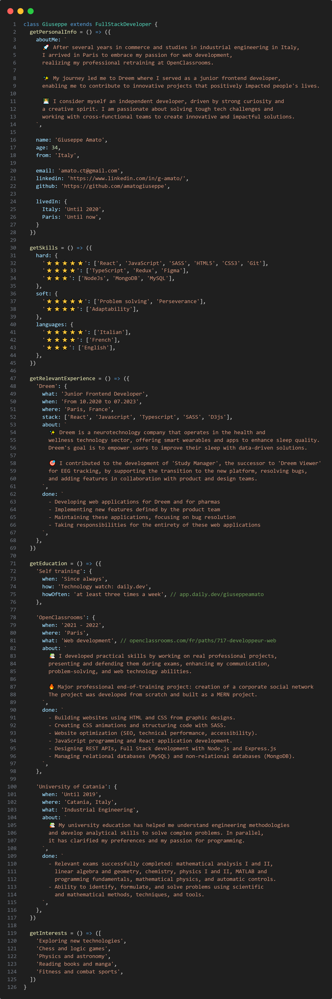

## 👋 Hey there! I'm Giuseppe, and welcome to my GitHub!

  

## 🙋‍♂️ About me

 

## 👨‍💻 Portfolio

Here are some projects I worked on during my OpenClassrooms training, showcasing my passion for web development:

- [Enterprise Social Network](https://github.com/amatogiuseppe/GiuseppeAmato_7_01072022)
  - Built from scratch using the MERN stack
  - _MongoDB, ExpressJS, ReactJS, NodeJS_
- [Secure API for a food review app](https://github.com/amatogiuseppe/GiuseppeAmato_6_06052022)
  - Implemented a secure backend and API following OWASP standards
  - _NodeJS, ExpressJS, MongoDB_
- [JavaScript E-commerce Site](https://github.com/amatogiuseppe/GiuseppeAmato_5_22032022)
  - Dynamically integrated API elements into web pages using JavaScript, without a front-end framework
- [Website Optimization](https://github.com/amatogiuseppe/GiuseppeAmato_4_12012022)
  - Improved website SEO, technical performance, and accessibility
- [Making a web page dynamic with CSS animations](https://github.com/amatogiuseppe/GiuseppeAmato_3_20112021)
  - Implemented CSS animations and managed code with SASS
- [Transformation of a model into a website with HTML & CSS](https://github.com/amatogiuseppe/Project-2)

 

## 🛠️ Tech Stack &nbsp; | &nbsp; 🔍 Tech Watch

&nbsp;&nbsp;
&nbsp;&nbsp;
&nbsp;&nbsp;
&nbsp;&nbsp;
 
&nbsp;&nbsp;
&nbsp;&nbsp;
&nbsp;&nbsp;
 
&nbsp;&nbsp;
&nbsp;&nbsp;
&nbsp;&nbsp;

Software and environments:

&nbsp;&nbsp;
&nbsp;&nbsp;
&nbsp;&nbsp;
&nbsp;&nbsp; 
&nbsp;&nbsp;
&nbsp;&nbsp;
&nbsp;&nbsp; 
&nbsp;&nbsp;
&nbsp;&nbsp; 
&nbsp;&nbsp;
&nbsp;&nbsp;
&nbsp;&nbsp; 
&nbsp;&nbsp;
&nbsp;&nbsp;

 

## ⚡  GitHub Analytics

  

 

## 🤝🏻 Connect with me

&nbsp;&nbsp;

